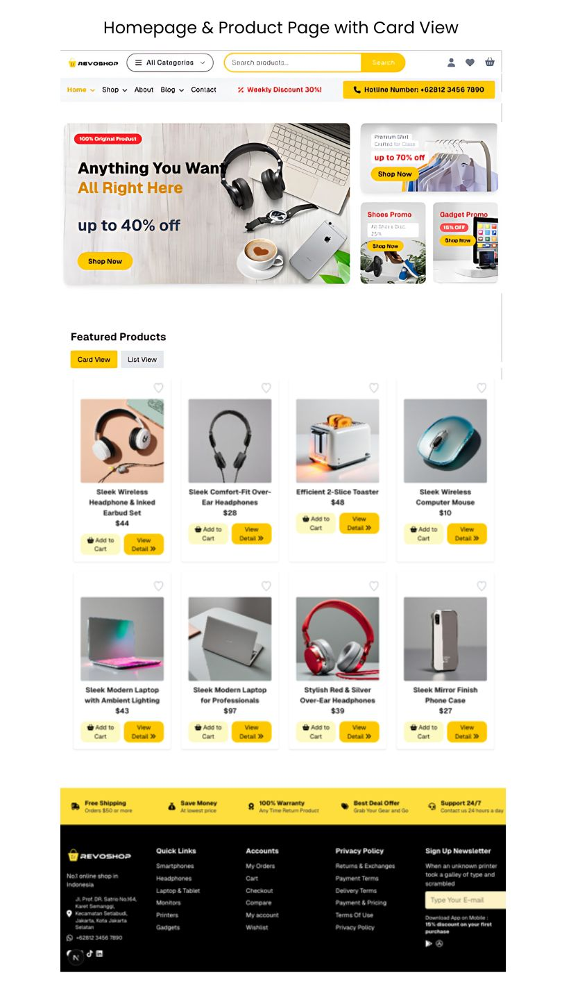
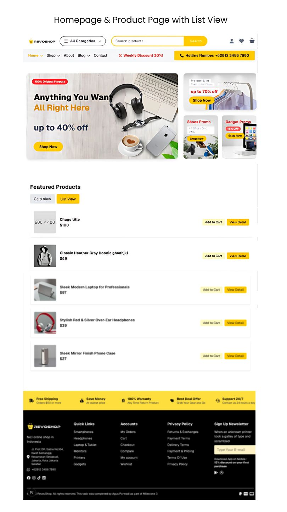
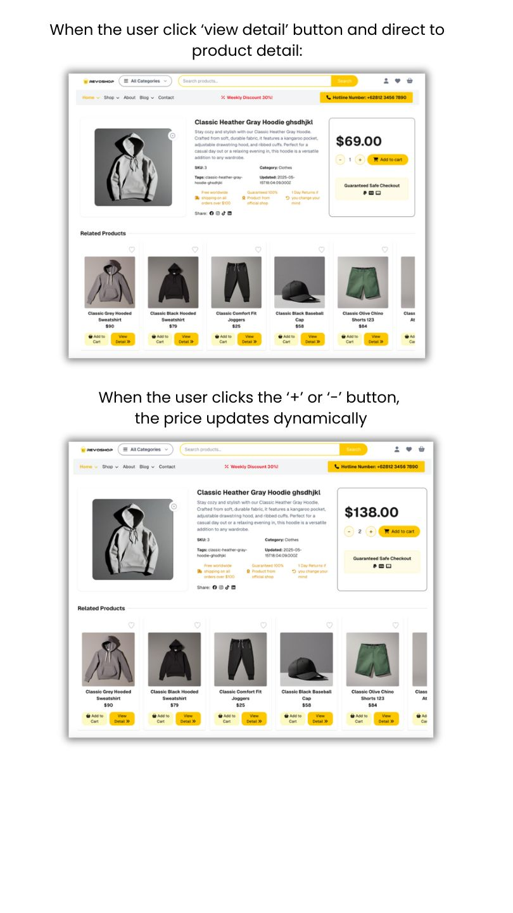
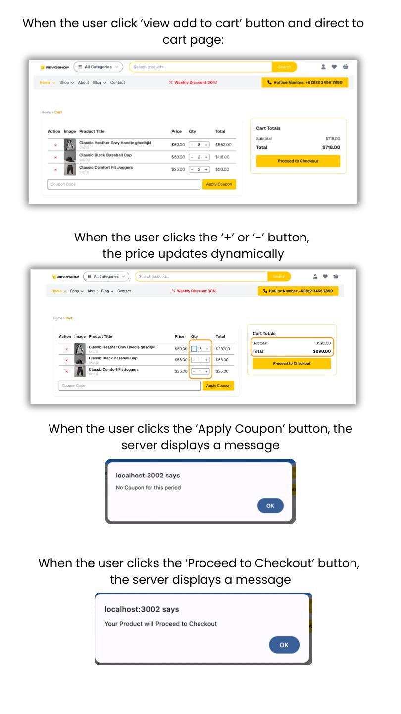

# Revoshop E-commerce Platform

This is a [Next.js](https://nextjs.org) e-commerce project bootstrapped with [`create-next-app`](https://nextjs.org/docs/app/api-reference/cli/create-next-app).

## Project Overview

Revoshop is a modern e-commerce web application featuring:
- Product listing with detailed views
- Dynamic related products section
- Add to cart functionality with quantity selection
- Cart management using localStorage
- Responsive design with Tailwind CSS
- Server-side rendering (SSR) for product pages

## Getting Started

First, run the development server:

```bash
npm run dev
# or
yarn dev
# or
pnpm dev
# or
bun dev
```

Open [http://localhost:3000](http://localhost:3000) with your browser to see the result.

You can start editing the page by modifying `app/page.tsx`. The page auto-updates as you edit the file.

This project uses [`next/font`](https://nextjs.org/docs/app/building-your-application/optimizing/fonts) to automatically optimize and load [Geist](https://vercel.com/font), a new font family for Vercel.

## Learn More

To learn more about Next.js, take a look at the following resources:

- [Next.js Documentation](https://nextjs.org/docs) - learn about Next.js features and API.
- [Learn Next.js](https://nextjs.org/learn) - an interactive Next.js tutorial.

You can check out [the Next.js GitHub repository](https://github.com/vercel/next.js) - your feedback and contributions are welcome!

## Deploy on Vercel

The easiest way to deploy your Next.js app is to use the [Vercel Platform](https://vercel.com/new?utm_medium=default-template&filter=next.js&utm_source=create-next-app&utm_campaign=create-next-app-readme) from the creators of Next.js.

Check out our [Next.js deployment documentation](https://nextjs.org/docs/app/building-your-application/deploying) for more details.

## Project Structure
├── README.md
├── next.config.ts
├── package.json
├── public/
│   ├── images/                # Static images for banners, logos, and promos
│   └── img-tutorial/          # Step-by-step tutorial images for documentation
│   ├── app/                   # Next.js application pages and layouts
│   │   ├── [id]/              # Dynamic route for product or page details
│   │   ├── cart/              # Cart page and related logic
│   │   ├── favicon.ico        # Site favicon
│   │   ├── globals.css        # Global CSS styles
│   │   ├── layout.tsx         # Main layout component
│   │   └── page.tsx           # Main landing page
│   ├── components/            # Reusable React components
│   │   ├── AddToCartButton.tsx            # Button to add products to cart
│   │   ├── CartClient.tsx                 # Cart display and logic
│   │   ├── Footer.tsx                     # Site footer
│   │   ├── Navbar.tsx                     # Top navigation bar
│   │   ├── NavbarSearch.tsx               # Search bar in navbar
│   │   ├── ProductPriceQuantityClient.tsx # Product price and quantity logic
│   │   ├── QuantitySelector.tsx           # Quantity selection component
│   │   ├── ShopCard.tsx                   # Product card for listings
│   │   └── ShopRow.tsx                    # Product row for listings
│   ├── services/              # Business logic and API calls
│   │   └── shopServices.ts    # Shop-related service functions
│   └── types/                 # TypeScript type definitions
│       └── type.ts            # Shared types and interfaces
├── tsconfig.json

## Tutorial
Follow these steps to use the platform:






